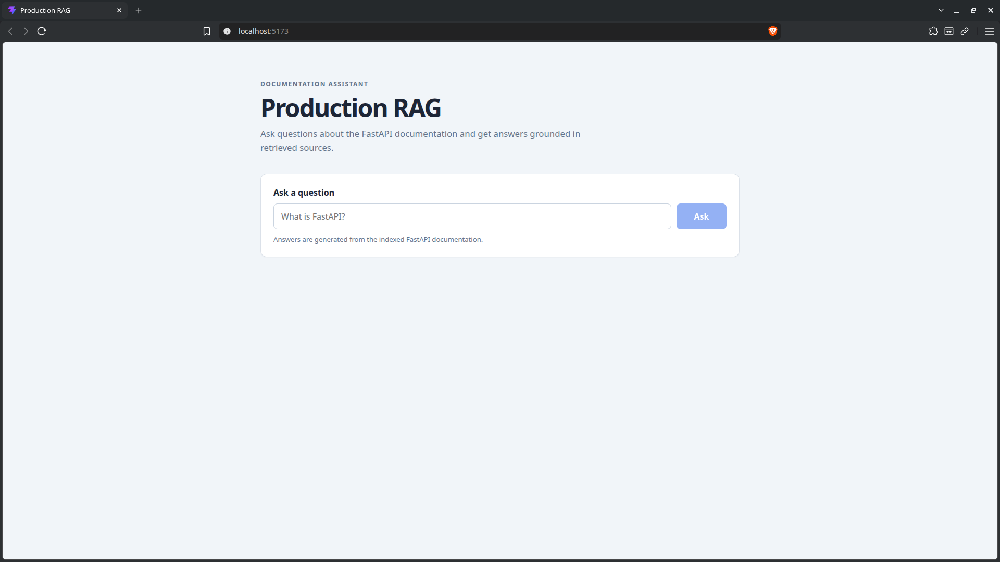
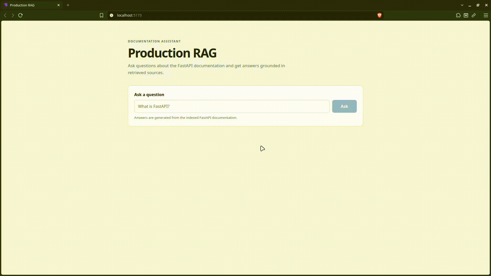

# Production RAG




A production-oriented Retrieval-Augmented Generation (RAG) system built with FastAPI, PostgreSQL, Qdrant, Sentence Transformers, and DeepSeek.

The project focuses on the engineering problems that appear when moving beyond a basic RAG prototype:

* structure-aware document ingestion
* idempotent document processing
* document versioning
* separation of metadata and vector storage
* PostgreSQL hydration after vector retrieval
* asynchronous LLM generation
* streaming API responses
* application lifecycle management
* retrieval and generation evaluation
* OpenTelemetry instrumentation
* automated testing and linting

The goal is not to build a large distributed platform. The goal is to demonstrate a clean, testable RAG architecture with sensible production-oriented engineering decisions.

---

## Architecture

The system processes a Markdown corpus through ingestion, chunking, embedding, vector storage, retrieval, metadata hydration, and LLM generation.

```text
                         ┌──────────────────────┐
                         │      Markdown        │
                         │       Corpus         │
                         └──────────┬───────────┘
                                    │
                                    ▼
                         ┌──────────────────────┐
                         │  FilesystemSource    │
                         │  SHA-256 hashing     │
                         └──────────┬───────────┘
                                    │
                                    ▼
                         ┌──────────────────────┐
                         │   MarkdownChunker    │
                         │ headings + code      │
                         │ structure metadata   │
                         └──────────┬───────────┘
                                    │
                                    ▼
                         ┌──────────────────────┐
                         │     PostgreSQL       │
                         │                      │
                         │ collections          │
                         │ documents            │
                         │ versions             │
                         │ chunks               │
                         │ embedding metadata   │
                         └──────────┬───────────┘
                                    │
                                    ▼
                         ┌──────────────────────┐
                         │   EmbeddingService   │
                         │ BGE-small-en-v1.5    │
                         │ 384 dimensions       │
                         └──────────┬───────────┘
                                    │
                                    ▼
                         ┌──────────────────────┐
                         │       Qdrant         │
                         │   vector storage     │
                         └──────────┬───────────┘
                                    │
                              query │
                                    ▼
┌──────────────┐          ┌──────────────────────┐
│    Client    │ ───────► │  RetrievalService    │
└──────────────┘          │                      │
                          │ query embedding      │
                          │ Qdrant search        │
                          │ PostgreSQL hydration │
                          └──────────┬───────────┘
                                     │
                                     ▼
                          ┌──────────────────────┐
                          │     RAGService       │
                          │                      │
                          │ retrieval            │
                          │ context construction │
                          │ LLM generation       │
                          └──────────┬───────────┘
                                     │
                                     ▼
                          ┌──────────────────────┐
                          │     DeepSeek API     │
                          │  async streaming     │
                          └──────────┬───────────┘
                                     │
                                     ▼
                          ┌──────────────────────┐
                          │    FastAPI /query    │
                          │      NDJSON          │
                          └──────────────────────┘
```

### Persistence boundary

PostgreSQL is the authoritative store for application metadata.

Qdrant is responsible for vector similarity search.

The application uses the following identity relationships:

```text
Application Collection → Qdrant Collection

Chunk                  → Embedding

Embedding.id           → Qdrant point ID
```

Qdrant search returns embedding IDs and similarity scores. The application then hydrates the corresponding chunk and document metadata from PostgreSQL.

Qdrant payloads are therefore not treated as the authoritative metadata store.

---

## Tech stack

| Area                | Technology                             |
| ------------------- | -------------------------------------- |
| Language            | Python 3.12+                           |
| API                 | FastAPI                                |
| Database            | PostgreSQL 17                          |
| Vector database     | Qdrant                                 |
| Infrastructure      | Docker Compose                         |
| ORM                 | SQLAlchemy 2                           |
| Migrations          | Alembic                                |
| Embeddings          | `BAAI/bge-small-en-v1.5`               |
| Embedding dimension | 384                                    |
| LLM                 | DeepSeek API                           |
| LLM client          | OpenAI Python SDK                      |
| Markdown parsing    | markdown-it-py                         |
| Evaluation          | Custom retrieval evaluation + DeepEval |
| Observability       | OpenTelemetry                          |
| Testing             | pytest                                 |
| Linting             | Ruff                                   |
| Package management  | uv                                     |

Redis is included in the development infrastructure, but it is not currently part of the RAG request path.

---

## Core engineering features

### Structure-aware Markdown chunking

Markdown is parsed structurally using `markdown-it-py` rather than being split using arbitrary character boundaries.

Chunks preserve structural information including:

* heading hierarchy
* heading paths
* code blocks
* chunk ordering
* document/version relationships

The default maximum chunk size is approximately 4,000 characters.

This is particularly useful for technical documentation where headings and code examples contribute significant retrieval context.

---

### Idempotent ingestion

Filesystem documents are identified using SHA-256 content hashes.

Re-ingesting an unchanged document does not create unnecessary new document versions.

The ingestion flow is:

```text
FilesystemSource
       ↓
BatchIngestionService
       ↓
DocumentIngestionService
       ↓
PostgreSQL
       ↓
EmbeddingService
       ↓
Qdrant
```

The CLI reports:

* documents discovered
* new documents
* chunks processed
* embeddings persisted

---

### Versioned document model

The persistence model separates document identity from individual document versions.

```text
Collection
    │
    └── Document
          │
          └── DocumentVersion
                │
                └── Chunk
                      │
                      └── Embedding
```

This allows the system to track document content independently from the stable document identity.

---

### Separate embedding entity

Embeddings are modeled as their own persistence entity rather than storing vectors directly with chunks.

An embedding records:

* chunk identity
* model name
* model version
* vector dimensions

Embedding identity is independent from chunk identity.

The current embedding model is:

```text
BAAI/bge-small-en-v1.5
Model version: 1
Dimensions: 384
Distance: Cosine
```

The actual vectors are stored in Qdrant.

---

### Retrieval with PostgreSQL hydration

The retrieval path is:

```text
User query
    ↓
BGE query embedding
    ↓
Qdrant similarity search
    ↓
Embedding IDs + similarity scores
    ↓
PostgreSQL lookup
    ↓
Chunk + source metadata
    ↓
Ranked RetrievalResult objects
```

Only the requested number of vector results is retrieved.

Results that cannot be hydrated from PostgreSQL are excluded from the final retrieval result.

---

### End-to-end RAG generation

`RAGService` composes retrieval and LLM generation.

The service:

1. retrieves relevant chunks
2. records retrieval latency
3. exposes retrieved sources
4. builds the retrieved context
5. sends the question and context to the LLM
6. streams generated text
7. reports total RAG latency

The generation instructions explicitly require the model to use only the retrieved context and to state when the context does not contain enough information.

---

### Streaming responses

The FastAPI `/query` endpoint returns:

```text
application/x-ndjson
```

The stream contains structured events for:

* retrieved sources
* generated text
* completion/timing information

A response is conceptually structured as:

```json
{"type":"sources","sources":[...]}
{"type":"complete","retrieval_time_ms":...,"total_time_ms":...}
{"type":"text","text":"..."}
```

The generated text is accumulated by the API and emitted as a final `text` event.

---

### Request validation

The API validates the request before starting the streaming response.

Current behavior includes:

| Condition                     | Response                 |
| ----------------------------- | ------------------------ |
| Valid query                   | `200` streaming response |
| Empty query                   | `422`                    |
| Invalid limit                 | `422`                    |
| Missing required field        | `422`                    |
| Malformed JSON                | `422`                    |
| Nonexistent Qdrant collection | `404`                    |

Collection existence is checked before the `StreamingResponse` is created. This prevents an invalid collection from producing a broken streaming response.

---

### Application lifecycle management

The FastAPI application creates a single `RAGService` during application startup.

```text
Application startup
        ↓
RAGService
        ↓
RetrievalService
        ↓
Qdrant client

        +

LLMService
        ↓
DeepSeek client
```

These resources are explicitly closed during application shutdown.

This avoids creating a new long-lived client for every API request.

---

### OpenTelemetry instrumentation

FastAPI is instrumented with OpenTelemetry.

The RAG pipeline also creates a dedicated `rag.generate` span.

The current RAG span records attributes including:

* collection
* retrieval limit
* retrieved chunk count
* retrieval latency
* total RAG latency

The current development configuration exports spans through the OpenTelemetry console exporter.

---

## Getting started

### Requirements

Install:

* Python 3.12+
* uv
* Docker
* Docker Compose

Clone the repository and enter the project directory.

Install dependencies:

```bash
uv sync
```

---

### Environment configuration

Create the local environment file:

```bash
cp .env.example .env
```

The application uses local services by default:

```text
PostgreSQL → localhost:5432
Qdrant     → localhost:6333
```

The DeepSeek API key should be configured locally.

Do not commit API keys or other secrets to the repository.

The DeepSeek settings currently include:

```text
DEEPSEEK_API_KEY
DEEPSEEK_BASE_URL
DEEPSEEK_MODEL
DEEPSEEK_TIMEOUT
```

The current default model configured by the application is:

```text
deepseek-v4-flash
```

---

### Start infrastructure

Start the development infrastructure:

```bash
docker compose up -d
```

Check service status:

```bash
docker compose ps
```

The Compose configuration currently provides:

* PostgreSQL
* Qdrant
* Redis

Redis is available for future use but is not currently required by the RAG request path.

---

### Run database migrations

Apply the current Alembic migrations:

```bash
uv run alembic upgrade head
```

---

## Ingestion

The project provides a CLI for ingesting Markdown documentation.

For example:

```bash
uv run production-rag ingest \
  --path data/raw/fastapi \
  --collection fastapi
```

The ingestion command:

1. creates the application collection if necessary
2. discovers Markdown files recursively
3. calculates SHA-256 content hashes
4. creates or reuses document records
5. creates document versions when required
6. chunks Markdown documents
7. generates embeddings
8. persists embedding metadata
9. creates the corresponding Qdrant collection if necessary
10. upserts vectors into Qdrant

The embedding service uses:

```text
BAAI/bge-small-en-v1.5
384 dimensions
Cosine similarity
```

---

## Querying

### CLI

The RAG system can be queried directly from the command line:

```bash
uv run production-rag query \
  "How do I create a FastAPI application?" \
  --collection fastapi \
  --limit 5
```

The CLI streams the generated answer and then prints the retrieved sources.

Example source information includes:

```text
- filesystem://path-params.md (chunk 17, similarity: 0.863)
```

---

### API

Start the FastAPI application:

```bash
uv run uvicorn production_rag.main:app --reload
```

Health check:

```bash
curl http://localhost:8000/health
```

Expected response:

```json
{"status":"ok"}
```

Query the RAG endpoint:

```bash
curl -N -X POST http://localhost:8000/query \
  -H "Content-Type: application/json" \
  -d '{
    "query": "How do I create a FastAPI application?",
    "collection": "fastapi",
    "limit": 5
  }'
```

The endpoint returns an NDJSON stream.

---

## Evaluation

The project currently evaluates both retrieval and end-to-end generation.

The evaluation corpus is the FastAPI documentation.

The dataset contains:

```text
24 evaluation examples
```

### Retrieval evaluation

The current retrieval evaluation is **chunk-level**.

Each evaluation example contains a set of relevant chunk IDs:

```text
relevant_chunks
```

Retrieved chunks are compared against those labeled relevant chunks.

The evaluation reports:

* Precision@K — chunk level
* Recall@K — chunk level
* Hit@K — chunk level
* MRR

The implementation explicitly reports these metrics as:

```text
Precision@K Chunks
Recall@K Chunks
Hit@K Chunks
MRR
```

### Current retrieval baseline

|  K | Precision@K Chunks | Recall@K Chunks | Hit@K Chunks |    MRR |
| -: | -----------------: | --------------: | -----------: | -----: |
|  1 |             0.4167 |          0.3264 |       0.4167 | 0.4167 |
|  3 |             0.1806 |          0.4028 |       0.4583 | 0.4375 |
|  5 |             0.1500 |          0.5417 |       0.6250 | 0.4750 |
| 10 |             0.0833 |          0.6250 |       0.7083 | 0.4889 |
| 20 |             0.0521 |          0.7569 |       0.8333 | 0.4991 |

The baseline is documented in:

```text
docs/evaluation/retrieval_baseline.md
```

The evaluation dataset is:

```text
data/evaluation/fastapi.json
```

---

### Generation evaluation

The generation evaluation runs the actual end-to-end RAG pipeline against the evaluation dataset.

For each example it records:

* question
* reference answer
* generated answer
* retrieved sources
* retrieval latency
* total RAG latency

The generated results are written to:

```text
docs/evaluation/generation_results.md
```

The current artifact contains 24 evaluation examples and is intended for manual comparison of generated answers against the reference answers and retrieved context.

DeepEval is included as the generation-evaluation dependency for further automated evaluation.

---

## Testing

Run the complete test suite:

```bash
uv run pytest -q
```

For environments where OpenTelemetry console output interacts with pytest's output capture, the suite can also be run with capture disabled:

```bash
uv run pytest -q -s
```

Run Ruff:

```bash
uv run ruff check .
```

The project is configured for:

```text
Python 3.12
Ruff line length: 88
pytest asyncio mode: auto
```

The test suite covers the major vertical slices of the application, including:

* application configuration
* Markdown chunking
* filesystem ingestion
* document ingestion
* document versioning
* repositories
* embeddings
* Qdrant integration boundary
* retrieval
* LLM service
* RAG orchestration
* API behavior
* request validation
* collection validation
* application lifecycle
* evaluation logic

---

## Project structure

```text
production-rag/
├── alembic/
│   ├── env.py
│   └── versions/
│       ├── 475d329a606c_create_initial_schema.py
│       └── 4d9a0c20621f_remove_embedding_vector_key.py
│
├── data/
│   ├── evaluation/
│   │   ├── fastapi.json
│   │   └── results/
│   │       └── fastapi-answer-baseline-2026-09-01.json
│   ├── raw/
│   │   └── fastapi/
│   └── tmp/
│
├── docs/
│   ├── adr/
│   │   ├── 001-multi-collection-workspaces.md
│   │   ├── 002-embeddings-as-separate-domain-entity.md
│   │   ├── 003-structure-aware-markdown-ingestion.md
│   │   └── 004-selective-use-of-langchain.md
│   ├── evaluation/
│   │   ├── generation_results.md
│   │   └── retrieval_baseline.md
│   └── corpus.md
│
├── src/
│   └── production_rag/
│       ├── api/
│       │   └── query.py
│       ├── core/
│       │   └── settings.py
│       ├── db/
│       ├── evaluation/
│       │   ├── answer.py
│       │   ├── dataset.py
│       │   ├── generation.py
│       │   └── retrieval.py
│       ├── ingestion/
│       ├── models/
│       ├── repositories/
│       ├── schemas/
│       ├── services/
│       │   ├── batch_ingestion.py
│       │   ├── document_ingestion.py
│       │   ├── embedding.py
│       │   ├── llm.py
│       │   ├── qdrant.py
│       │   ├── rag.py
│       │   └── retrieval.py
│       ├── telemetry.py
│       └── main.py
│
├── tests/
├── .env.example
├── alembic.ini
├── docker-compose.yml
├── pyproject.toml
└── uv.lock
```

---

## Corpus

The current evaluation corpus is the FastAPI documentation.

The corpus is pinned to a specific FastAPI documentation revision to keep evaluation reproducible.

Corpus details are documented in:

```text
docs/corpus.md
```

The local corpus is stored under:

```text
data/raw/fastapi/
```

---

## Design decisions

Important architectural decisions are documented as Architecture Decision Records under:

```text
docs/adr/
```

Current ADRs cover:

### Multi-collection architecture

Application collections map to independent Qdrant collections.

This allows separate corpora/workspaces to maintain independent vector indexes.

### Embeddings as a separate domain entity

Embeddings are modeled separately from chunks so that embedding model identity and versioning remain explicit.

### Structure-aware Markdown ingestion

Markdown structure is retained during chunking instead of treating the corpus as plain text.

### Selective technology usage

The project avoids adopting frameworks simply because they are common in RAG tutorials.

In particular, the core ingestion pipeline does not depend on LangChain.

---

## Scope

This project intentionally targets a production-oriented portfolio implementation rather than a full SaaS platform.

### Implemented

* [x] Markdown ingestion
* [x] Recursive filesystem source
* [x] SHA-256 content hashing
* [x] Idempotent document ingestion
* [x] Document versioning
* [x] Structure-aware Markdown chunking
* [x] PostgreSQL persistence
* [x] Separate embedding entity
* [x] BGE-small embeddings
* [x] Qdrant vector storage
* [x] Qdrant collection validation
* [x] PostgreSQL retrieval hydration
* [x] Similarity retrieval
* [x] DeepSeek LLM integration
* [x] Asynchronous streaming generation
* [x] End-to-end RAG orchestration
* [x] CLI ingestion
* [x] CLI querying
* [x] FastAPI `/query` endpoint
* [x] NDJSON streaming responses
* [x] Request validation
* [x] Nonexistent collection handling
* [x] Application lifecycle management
* [x] Retrieval evaluation
* [x] Generation evaluation artifacts
* [x] OpenTelemetry instrumentation
* [x] Automated tests
* [x] Ruff linting

---

## Deliberately out of scope

The project deliberately avoids adding distributed infrastructure without a demonstrated requirement.

Currently avoided:

* Celery
* Kafka
* event-driven outbox architecture
* Kubernetes
* distributed transactions
* unnecessary caching
* unnecessary service decomposition
* large orchestration frameworks for ingestion

Redis is present in Docker Compose but is not currently used by the RAG request path.

---

## Current status

The core RAG vertical slice is functional:

```text
Markdown corpus
      ↓
Filesystem ingestion
      ↓
Structure-aware chunking
      ↓
PostgreSQL metadata
      ↓
BGE embeddings
      ↓
Qdrant
      ↓
Similarity retrieval
      ↓
PostgreSQL hydration
      ↓
Context construction
      ↓
DeepSeek generation
      ↓
Streaming FastAPI response
      ↓
Evaluation
      ↓
OpenTelemetry tracing
```
## Roadmap

Potential future work includes:

1. Improve operational documentation.
2. Tighten ingestion/vector lifecycle consistency.
3. Expand evaluation methodology and datasets.
4. Improve failure handling around external services.
5. Add targeted production-hardening tests.
6. Revisit caching only if profiling demonstrates a meaningful need.
7. Add deployment-oriented configuration if the system is eventually deployed.
